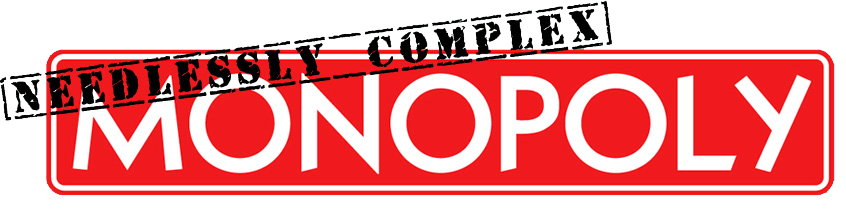

# Rules

Those of us who love Monopoly love it dearly. It speaks to our competitive spirit with a persuasiveness and authority that remains unchallenged in the gaming world. But while Monopoly might have once provided a welcome distraction in post-depression America, the 2009 Housing Market Crash and the subsequent Occupy Wall Street movement have created new challenges that demand a more complex diversion. This variation on Hasbro's Monopoly[\*](#notes) uses the standard board and is based on the same basic premise, but with some twists to bring it up to speed with the trials & tribulations we must brave in today's economy.

* [Cash](#cash)
  + :moneybag: Supply
* [Properties](#properties)
  + :hammer: Auctions
  + :bank: Mortgages
  + :smiling_imp: Squatter's Rights
  + :airplane: Air Rights
  + :bowtie: Gentrification
* [Interactions](#interactions)
  + :two_men_holding_hands: Joint Ventures
  + :mask: Insurance
  + :crystal_ball: Purchase Options
* [Loans](#loans)
  + :money_with_wings: Bank Loans
  + :gift: Private Loans
* [Municipal Services](#municipal-services)
  + :station: Railoads
  + :car: Free Parking
  + :question: Community Chest & Chance
  + :arrow_left: GO
  + :ring: Luxury Tax
  + :zap: Utilities
* [Shots](#shots)
  + :earth_americas: Locations
  + :game_die: Utilities
  + :beers: Rent
* [Proposed Amendments](#proposed-amendments)
* [Notes](#notes)

## Cash

### :moneybag: Supply
Needlessly Complex Monopoly players are encouraged to double the money supply by adding the money from a second Monopoly game. Players should start with **at least M̶2,000**, to be adjusted depending on the number of players.

## Properties

### :hammer: Auctions
When a player lands on an unclaimed property, any other player may initiate an open auction for the property. A bid to initiate an open auction must be a **minimum of one and a half times** the standard purchase price. All bidding increases must be a minimum of half the standard purchase price.

### :bank: Mortgages
Mortgaged properties which have reverted to the bank can be purchased by any player at any time, at either **face value or a higher value** through an open auction.

### :smiling_imp: Squatter's Rights
Instead of engaging in the normal bidding process when landing on an unowned space, a player may choose to exercise his "squatter's rights" by remaining on the desired space until he has **skipped the number of turns equal to the leading digit of the price of the property plus one**. At the conclusion of the squatting period, the player is granted the property at no cost. Mortgaged properties remain mortgaged if moving from the bank to a squatter. A player **cannot voluntarily abandon his squat**. Any other player can break an attempted squat by landing on the property and initiating the standard bidding process. Invoking squatter's rights to prolong the game and avoid certain death is contrary to the spirit of the rule. To enforce this, squatter's rights **cannot be invoked unless there are 4 or more players** in the game.
> **Example:** A player can land on Boardwalk, priced at M̶400 and opt to skip his next 5 turns. He would receive Boardwalk on the start of his 6th turn.

### :airplane: Air Rights
A player who owns a property at the edge of a color group can purchase air rights from the owner of the nearest property (excluding railroads and utilities) of a different color group. Air rights permit the purchaser to build **an additional hotel** on the specified property. The seller of air rights must sell all existing hotels and houses and is prohibited from building improvements on the property unless the air rights are repurchased.

### :bowtie: Gentrification
Houses and hotels on the pink color group (St. Charles Place / States Avenue / Virginia Avenue ) increase property values for the light blue color group (Oriental Avenue / Vermont Avenue / Connecticut Avenue). Houses and hotels cause **purchase costs, rents, and improvement costs** to increase on the gentrified properties by 25% and 50%, respectively.

1. A 1.5x multiplier is used to determine rents on hotels in excess of the first hotel on a property.

2. A player owning two properties which are eligible to sell air rights to each other can freely transfer air rights between these properties.

3. Purchased air rights are transferred with a property when sold to another player or mortgaged to the bank.

Once a house has been built on the pink color group, a **hotel is added to Jail**. Visitors to Jail must pay M̶50. Jailed players pay M̶50 per turn while in Jail or can pay M̶250 for immediate release.

## Interactions

### :two_men_holding_hands: Joint Ventures
Joint ventures for ownership of property are **permitted**.

1. For the purposes of allocating mortgage rights and determining net worth and tax assessments, one player must be designated as the legal owner of the property of each joint venture.

2. Unless prohibited by the terms of the joint venture, any participant in a joint venture can build improvements on the jointly owned property. All improvements are considered to be owned by the legal owner of the joint venture.

3. Joint ventures are **restricted to two players**. Joint ventures with three or more players are not permitted.

4. Unless otherwise negotiated, joint ventures encompass all properties within a color group and provide the player who is not the legal owner with **immunity from rent payments** on these properties.

6. With the exception of immunities between joint venture partners on partnership property, **direct immunities are prohibited**. A player cannot grant another player any temporary or permanent immunity from rent on a given property.

### :mask: Insurance
Players may sell insurance to other players (a form of third-party immunity). If the policyholder lands on a property specified by an insurance policy, the **insurer is obligated to pay full rent** on behalf of the policyholder to the landlord, unless otherwise directed by the policy. Insurance can be limited (valid for a set number of rolls and/or for a set distance on the board) or indefinite. Insurance may be canceled by mutual consent.

1. Insurance policies can be sold or traded to other players.

2. An insured player remains liable to a landlord for completion of a rent payment in the event that an insurer goes bankrupt

### :crystal_ball: Purchase Options
Players may sell purchase options on unclaimed properties to other players. In an option, Player 1 sells a Player 2 the opportunity to purchase an unclaimed property if Player 1 lands on this property. Purchase options can be limited (valid for a set number of rolls and/or for a set distance on the board) or indefinite (valid until the property is purchased). Purchase options may be canceled by mutual consent.

1. If a player invokes an option to purchase an unclaimed property, any other player is permitted to initiate an **open auction**.

2. Purchase options can be sold or traded to other players.

## Loans

### :money_with_wings: Bank Loans
The bank can finance the acquisition of property or the construction of houses or hotels. Loans are issued at a **fixed interest rate** (25% for loans less than M̶1,500 and 40% for larger loans) and a **three turn term**, with payment beginning on the **player's next turn**. Bank loans have **absolute priority** and must be repaid before a player makes any other payments on his turn. Loans can only be issued during a player's turn and can be issued before or after a dice roll. Prepayment is allowed with no penalty.

1. A player may not have more than one bank loan outstanding at any time.

2. A player can only **refinance once** during a game.

3. Fraudulent conveyances: A player facing a principal payment on his next turn cannot purchase houses or hotels for the benefit of a joint venture partner unless the purchase leaves him enough money to cover his principal payment.

### :gift: Private Loans
Players may issue and accept private loans. Private loans can be negotiated between players at **any interest rate, maturity, or priority** (below bank loans) as players want and can be issued at any time.

## Municipal Services

### :station: Railoads
Travel between owned railroads is permitted. A player may freely travel between his own railroads. Travel from or to railroads owned by other players may be negotiated with the owners of both the starting railroad and the ending railroad. Travel along an unowned railroad is not permitted. A player **does not receive M̶200 if passing GO** via a railroad.

### :car: Free Parking
A Free Parking pool is seeded at the beginning of the game with M̶500. **All Tax payments are paid to the pool**, as are Chance and Community Chest payments, excluding payments directed to other players. Each time a player lands on Free Parking and claims the Free Parking pool, the pool is reseeded. The **seed amount increases by M̶50** each time the pool is claimed.

### :question: Community Chest & Chance
All dollar values on Community Chest and Chance cards are **doubled**.

1. This rule does not apply to any cards requiring payments to all players.

2. This rule does not apply to any cards requiring payments based on the number of improvements a player owns.

### :arrow_left: GO
Each time a player lands on GO, the player **rerolls the dice**. The bank pays the player the value of the roll times M̶50 in lieu of the standard GO payment.

1. If a player rolls doubles to land on GO and is eligible to move again, the player rerolls the dice a second time to determine his next move.

2. If a player lands on GO as the result of a **third consecutive doubles**, the player moves directly to Jail and does not receive payment.

### :ring: Luxury Tax
Luxury Tax assessments are calculated as the greater of M̶100 or the sum of M̶25 per each house and M̶100 per each hotel owned by the player.

1. If a player must sell improvements to satisfy a Luxury Tax assessment, any **sold improvements do not count** towards the assessment.

### :zap: Utilities
1. Utility rents are **doubled**.

2. Players must pay recurring utility bills to utility owners. Utility bills are M̶5 per owned utility and are due upon the demand of the utility owner at the start of that player's turn.

## Shots

If the role of Player is filled by a multi-person team, **each team member** must consume the number of shots required of the Player. David Goldberg[\*\*](#notes) has to drink *at least* one beer.

### :earth_americas: Locations
A player must consume a shot if he lands on the space containing the **name of the state where he resides**, or:

1. Pacific Avenue for residents of California, Oregon, Washington, Alaska, and Hawaii.

2. Atlantic Avenue for residents of Maine, New Hampshire, Massachusetts, New Jersey, Delaware, South Carolina, Georgia, and Florida.

3. B&O Railroad for residents of Maryland and Ohio.

4. Pennsylvania Avenue but not Pennsylvania Railroad for residents of Pennsylvania.

5. States Avenue for all other players.

6. A player who rolls 11 from Virginia Avenue must take 3 shots or pay a fine of M̶600, or a combination thereof.

    a. This rule does not apply to residents of Virginia, Maryland, and Ohio.

### :game_die: Utilities
A player landing on a utility may choose to substitute the consumption of shot(s) for payment of rent. Substitution **does not require the consent of the landlord**. If both utilities are owned, two shots must be consumed if forgoing payment (one shot and half the expected payment is also permissible). If one utility is owned, one shot must be consumed if forgoing payment.

### :beers: Rent
On all properties other than utilities, a player may substitute the consumption of shot(s) or other consideration in lieu of payment of rent at the discretion of the landlord.

## Meta Rules

1. No rule can ever be repealed. 

## Proposed Amendments

- Baltic and Mediterranean become highways once they are an owned monopoly.

## Notes

*\* This is not a commercial product. It's a variation on a popular game made up by some dudes who like playing Monopoly. These rules are made public so other people can enjoy playing this variation as much as we do, and so we can look them up online when we're too drunk to remember. We're seriously not trying to cause any trouble, or make any money. Legal concerns can be sent to: shotgunracecar@needlesslycomplexmonopoly.com*

*\*\* Replace "David Goldberg" with the name of your most sober/responsible player.*
